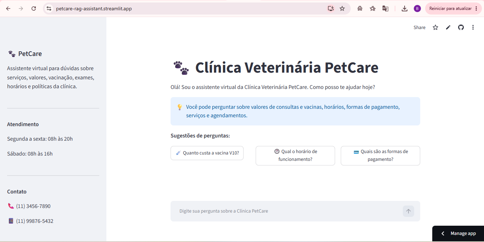
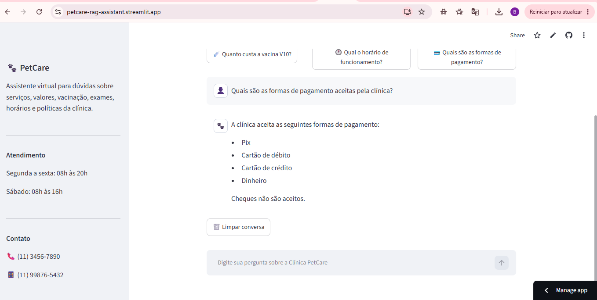

## 🌐 Aplicação online

Acesse o assistente virtual:

https://petcare-rag-assistant.streamlit.app

# 🐾 Clínica Veterinária PetCare — Assistente Virtual com RAG

Este projeto foi desenvolvido como parte do Challenge da trilha **Inteligência de Dados e RAG Avançado**, do programa Oracle Next Education (ONE).

O projeto consiste em um assistente virtual capaz de responder perguntas sobre uma clínica veterinária fictícia utilizando informações presentes em documentos PDF.

A aplicação utiliza a técnica de **RAG (Retrieval-Augmented Generation)** para buscar informações relevantes nos documentos da Clínica Veterinária PetCare e utilizá-las como contexto para a geração das respostas.

O assistente permite realizar perguntas sobre consultas, serviços veterinários, vacinação, exames, valores, formas de pagamento, horários de funcionamento e políticas da clínica.

## 🖥️ Interface da aplicação

A aplicação possui uma interface web desenvolvida com Streamlit para interação com o assistente virtual.



### 💬 Exemplo de interação

O assistente utiliza as informações recuperadas dos documentos da clínica para responder às perguntas do usuário.



## ⚙️ Como funciona

O funcionamento do assistente segue um fluxo de RAG:

1. Os documentos PDF da Clínica Veterinária PetCare são carregados pela aplicação.
2. Os textos são divididos em pequenos trechos (chunks).
3. Cada chunk é transformado em uma representação vetorial por meio de embeddings.
4. Os embeddings são armazenados em um Vector Store em memória.
5. Quando o usuário realiza uma pergunta, ela é contextualizada considerando o histórico da conversa.
6. O retriever utiliza MMR (Maximal Marginal Relevance) para selecionar os trechos mais relevantes dos documentos.
7. Os trechos recuperados são enviados como contexto para o modelo de linguagem.
8. O modelo gera a resposta utilizando apenas as informações recuperadas dos documentos.

## 🛠️ Tecnologias utilizadas

- **Python** — linguagem principal utilizada no desenvolvimento da aplicação.
- **LangChain** — utilizado para estruturar o fluxo de RAG, manipulação dos documentos e recuperação das informações.
- **Hugging Face Embeddings** — utilizado para transformar os trechos dos documentos em representações vetoriais.
- **InMemoryVectorStore** — armazenamento vetorial utilizado para realizar a busca semântica nos documentos.
- **MMR (Maximal Marginal Relevance)** — estratégia utilizada pelo retriever para selecionar chunks relevantes e diversificados.
- **Groq** — API utilizada para acesso ao modelo de linguagem.
- **GPT-OSS 120B** — modelo de linguagem utilizado para gerar as respostas do assistente por meio da API Groq.
- **Streamlit** — utilizado para desenvolver a interface web do chatbot.
- **PyPDFLoader** — utilizado para carregar e extrair o conteúdo dos documentos PDF.
- **python-dotenv** — utilizado para carregar a chave da API por meio de variável de ambiente.


## 📁 Estrutura do projeto

```text
PetCare/
│
├── Documentos/
│   └── Arquivos PDF utilizados como base de conhecimento
│
├── app.py
├── requirements.txt
├── .gitignore
└── README.md
```

### Principais arquivos

- **app.py** — contém o carregamento dos documentos, criação dos embeddings, Vector Store, fluxo de RAG e interface em Streamlit.
- **Documentos/** — contém os PDFs utilizados como base de conhecimento pelo assistente.
- **requirements.txt** — contém as dependências necessárias para executar o projeto.
- **.gitignore** — define arquivos e pastas que não devem ser enviados ao repositório.
- **README.md** — documentação e apresentação do projeto.


## 💬 Exemplos de perguntas e respostas

### Exemplo 1 — Consulta

**Pergunta:**  
Quanto custa uma consulta cardiológica?

**Resposta:**  
Uma consulta cardiológica na Clínica Veterinária PetCare custa R$ 260,00.

### Exemplo 2 — Vacinação

**Pergunta:**  
Quanto custa a vacina V10?

**Resposta:**  
A vacina V10 Canina custa R$ 165,00.

### Exemplo 3 — Política de pagamento

**Pergunta:**  
Posso parcelar uma cirurgia?

**Resposta:**  
Sim. Procedimentos cirúrgicos acima de R$ 500,00 podem ser parcelados em até 6 vezes sem juros no cartão de crédito.

### Exemplo 4 — Informação não disponível

**Pergunta:**  
A clínica oferece banho e tosa?

**Resposta:**  
Não encontrei essa informação nos documentos da Clínica Veterinária PetCare.

### Exemplo 5 — Memória contextual

**Usuário:**  
Quanto custa uma consulta cardiológica?

**Assistente:**  
Uma consulta cardiológica custa R$ 260,00.

**Usuário:**  
E quanto tempo ela dura?

**Assistente:**  
A consulta tem duração média de 40 minutos.


## 🚀 Como executar o projeto

### 1. Clone o repositório

```bash
git clone URL_DO_REPOSITORIO
```

### 2. Acesse a pasta do projeto

```bash
cd PetCare
```

### 3. Crie um ambiente virtual

```bash
python -m venv .venv
```

### 4. Ative o ambiente virtual

No Windows:

```bash
.venv\Scripts\activate
```

### 5. Instale as dependências

```bash
pip install -r requirements.txt
```

### 6. Configure a chave da API Groq

Crie um arquivo `.env` na raiz do projeto e adicione:

```text
GROQ_API_KEY=sua_chave_aqui
```

> O arquivo `.env` não é versionado no repositório por questões de segurança.

### 7. Execute a aplicação

```bash
streamlit run app.py
```

Após iniciar, a aplicação poderá ser acessada pelo endereço local exibido pelo Streamlit no terminal.


## ⚠️ Limitações

- O assistente responde com base exclusivamente nos documentos disponibilizados na base de conhecimento da Clínica Veterinária PetCare.
- Informações que não estejam presentes nos documentos podem não ser respondidas.
- Os dados, valores, contatos e informações da clínica são fictícios e foram criados exclusivamente para fins acadêmicos.
- O Vector Store utilizado é armazenado em memória e recriado sempre que a aplicação é iniciada.


## 👩‍💻 Autora

**Barbara Moreira**

Projeto desenvolvido para o Challenge da trilha **Inteligência de Dados e RAG Avançado — Oracle Next Education (ONE)**.